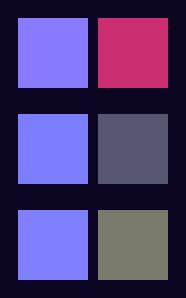
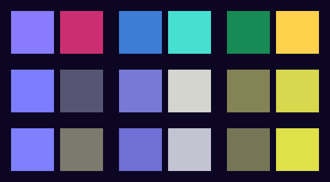

# Colour-blindness palette verification (#354)

The shipping **Purple** accent pair (`primary #887BFF` / `accent #CC2F71`)
tests *mildly*: under protanopia and deuteranopia the primary and accent both
drift toward similar grey-browns, so a colour-blind listener can lose the
visual distinction between the brand-primary "now playing" wash and an accent
call-to-action.

This directory documents the two colour-blind-safe fallback presets added in
`Theme.swift` — **Ocean** and **Forest** — plus the reproducible numbers that
back them. The presets are modelled by `ThemePreset` and guarded by
`macos/Tests/LyrebirdTests/ThemePresetTests.swift`.

## Palettes

| Preset | Primary   | Accent    | Axis |
|--------|-----------|-----------|------|
| Purple | `#887BFF` | `#CC2F71` | violet / magenta (shipping default) |
| Ocean  | `#3D7DD6` | `#47E0D0` | blue / teal-cyan — rides the blue–yellow channel that protanopes/deuteranopes retain |
| Forest | `#178A55` | `#FFD24D` | deep green / warm gold — large lightness gap keeps the pair separable when hue is lost |

App surfaces the brand colours sit on: `Theme.bg = #0C0622`,
`Theme.bgAlt = #140B30`.

## Contrast (WCAG 2.1 §1.4.11, UI-component threshold 3:1)

Primary and accent are used as large fills (swatch rings, badges, the
now-playing wash), so the governing minimum is **3:1**. Every preset clears it
on both dark surfaces:

| Preset | Primary vs `bg` | Primary vs `bgAlt` | Accent vs `bg` | Accent vs `bgAlt` |
|--------|-----------------|--------------------|----------------|-------------------|
| Purple | 5.94 | 5.64 | 3.96 | 3.76 |
| Ocean  | 4.79 | 4.55 | 12.06 | 11.46 |
| Forest | 4.51 | 4.29 | 13.69 | 13.01 |

## Dichromat separation

Primary↔accent Euclidean distance in Viénot-1999 dichromat-projected LMS
space (higher = more distinguishable to that viewer). The shipping pairs stay
well clear of the ~400 protanopia collapse seen with a naive green/gold pair
(`#52C46B`/`#E0B341`, rejected during tuning):

| Preset | Protanopia | Deuteranopia | Tritanopia |
|--------|-----------:|-------------:|-----------:|
| Purple | 3116 | 1512 | 2218 |
| Ocean  | 8362 | 6728 | 7104 |
| Forest | 7991 | 9866 | 9547 |

`ThemePresetTests` asserts Ocean/Forest separate by ≥1000 for every type.

## Auto-suggest

`ThemePreset.suggestedForAccessibility()` returns `.ocean` when
`NSWorkspace.shared.accessibilityDisplayShouldDifferentiateWithoutColor` is
set (System Settings → Accessibility → Display → "Differentiate without
color"). The Appearance preferences pane surfaces a hint steering toward Ocean
in that case. Full per-preset token resolution is the theme-engine work in
\#405; until then the presets back the picker swatches + this suggestion.

## Reproducing the numbers

The contrast and dichromat figures above are computed by the same maths as
`Color.contrastRatio` / `ThemePresetTests`. To regenerate:

```bash
python3 macos/docs/a11y/color-blindness/verify.py
```

## Before / after

Each grid renders the preset `primary` + `accent` swatch pairs as the picker
shows them, across three rows — **normal vision**, **protanopia**, and
**deuteranopia** (the two deficiencies called out in the issue). Reading a
row left-to-right: each preset is a `primary` square next to its `accent`
square.

| | Swatch pairs · normal / protanopia / deuteranopia |
| --- | --- |
| **Before** — Purple only |  |
| **After** — Purple · Ocean · Forest |  |

In the "before" grid the Purple `primary`/`accent` pair drifts toward similar
muted tones in the protanopia and deuteranopia rows — the exact failure the
issue describes. In the "after" grid the added **Ocean** and **Forest** pairs
stay visibly separated in every row.

These PNGs are an exact, reproducible render of the swatch pixels (swatch
colour is fully determined by the preset hex; the dichromat rows use the same
Viénot-1999 projection as `ThemePresetTests` / `verify.py`), not a hand-captured
simulator grab. Regenerate them after any palette change:

```bash
python3 macos/docs/a11y/color-blindness/render_previews.py
```

### Optional: live simulator capture

For a true on-device pass (e.g. to spot rendering issues the swatch render
can't show), build + launch with `./macos/Scripts/a11y-audit.sh`, point
**Accessibility Inspector** or **Sim Daltonism** at the running `Lyrebird`
process, open **Preferences → Appearance**, and capture each preset under
normal / protanopia / deuteranopia / tritanopia.
